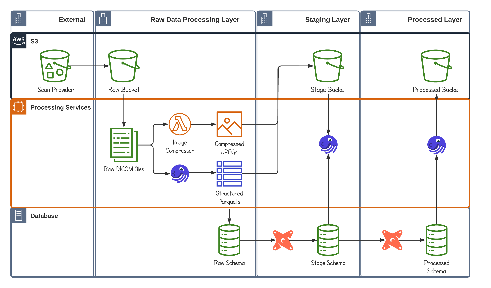
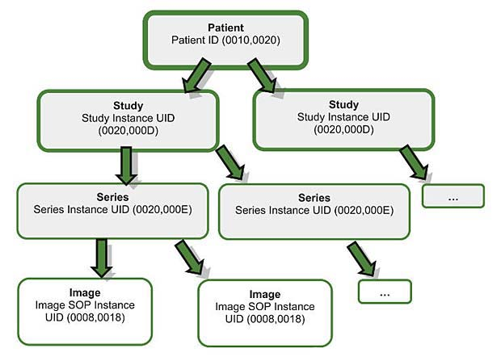

# Cloud-based ETL Pipeline (DICOM Medical Data)

The idea for this project is to create a system that can provide analytics on the fly and introduce a customizable tool for developers, data scientists, and analysts of any kind to set up their own stack based on the architecture that is described below so that they can test machine learning models, asset picking agents or to build a general statistical API to make decisions faster and minimize time to delivery for their research. This article serves as a gateway to understanding general decision-making during the ETL design of a data pipeline. Thank you for reading and I hope that you found something of use here. This project implements a scalable data pipeline for medical scans using modern stack: [Dagster](https://dagster.io/), [dbt](https://docs.getdbt.com/docs/introduction) for data orchestration and [Amazon S3 Service](https://aws.amazon.com/s3/), SQLite (more specifically [Snowflake](https://quickstarts.snowflake.com/), [DuckDB](https://duckdb.org/)) for persistence across transformations. Medical data comes in the form of [DICOM](https://en.wikipedia.org/wiki/DICOM) files.

## Pipeline Architecture



In order to perform transformations on data I chose **Dagster** for no particular reason aside from testing the orchestrator. I have used **Airflow** for over 5 years, so was curious to discover what it has to offer in comparison. The tool is is still in development and some features may change, however, it certainly has benefits in comparison such as the amount of code being reduced significantly, configuration and segregation between data and io managers (files, databases); Some parts of the pipeline require us to use tools outside of SQL, such as [**PySpark**](https://spark.apache.org/faq.html) in order to store data on **s3**, as well as to control code execution to meet asset dependencies upstream. **Dagster** satisfies those requirements and as a proof of concept tool to facilitate orchestration it does a decent job. Another tool **dbt** was chosen to facilitate SQL code usage across different databases; it offers an interesting set of tools to minimize your codebase through macros and generate SQL code with jinja. In other terms, write less code, reuse common expressions, and have a database-agnostic connector. For more macros, code that supports repo navigate to **dbt** [directory](./services/dicom-pipeline/dbt_snowflake/README.md) For storage, there are two modes that address different business needs; The First one is **S3** storage that collects data at every stage of data processing and is used for long-term persistence, data restatement, as well as directly by ML engineers to tweak, train and develop their models.

SQLite database on the other hand, stores data in either **DuckDB** or **Snowflake** for analytical purposes, as it allows retrospective research without loading files, working with schemas - SQL querying should be sufficient for quick and dirty prototyping, as well as for more thorough analysis requiring statistical aggregates over different dimensions of data. The database layer corresponds to SQLite database (targeting **Snowflake**) and would be used by production services (e.g. ML feature store) as well as by users to perform data analysis without building a pipeline. The long-term persistence **S3** layer is shared across all transformations and is useful to access once raw data is needed to train ML models, as well as to persist schema change, and data history to recover information in the case of data corruption.

Processing can be divided into three general steps: extraction, transformation, and load. Extraction refers to gathering data from external sources that can come in the form of an API, **S3** files, web sockets; In this case, I focused on **S3** bucket approach due to the nature of the problem: bulk processing over daily operations is a regular medical routine and most of the ETL is organized accordingly - with scheduled uploads of medical data to scalable storage. `Raw` data processing refers to the transformation layer that should clean, type cast data acquired from the previous step. It is a critical step to obtain control over new data, grasp inner relations, and load it properly as later stages would benefit greatly due to the reason that users will focus on developing analytical insight rather than constructing cleaning routines for each new provider. `Staging` refers to the intermediate layer that will have already cleansed data and offer a layer for combining entities into more complex structures such as monthly, and daily financial aggregates; This layer is mostly SQL-like and should be accessible for analysts to test hypotheses and do due dilliigent research into properly organizing `dimensions` and `fact` tables to reduce duplication and save processing costs. Finally, `processed` level refers to the aggregate layer, event tables, and fact tables that can be used in production for quick research and by other services (i.e. BI tools, ML models, and production applications).

## Data Processing Strategy

In my opinion data processing strategy should come from business needs and offer a "good-enough" solution that can sustain current business requirements by delivering more value than creating trouble. By trouble, I mean developer experience, unexpected bottlenecks, and unexpected deprecation of service-critical APIs. Even though, we cannot predict absolutely everything - we should focus on common pitfalls that arise during the design of ETL pipelines, as well as to take time to evaluate potential business-related risks. Focus on tools that offer long-term scaling, transparent software that can be quickly configured, processing that can scale in the future when data grows bigger, and deliver sustainable, predictable SLAs.

#### DICOM processing constraints

In terms of data, it is critical to grasp what data represents and how it can be valuable to the project. In our case **DICOM** files represent an aggregated view over a medical study that has occurred, it includes, but is not limited to: `study` (investigation for the health inquiry), `series` (list of related health evaluation procedures), `images` (medical scans i.e. MRI for each procedure in series), `devices` (equipment used to perform scan), `patients` (patient description details). Again, there is no distinction on the level of data for those entities, file itself offers a list of fields such as: `PixelData`, `PatientName`, `DeviceSerialNumber`, which require time to deduct corresponding tables that we would like to form for use in our case. The mapping procedure can be done either by a field expert or using public information (e.g. [DICOM Browser](https://dicom.innolitics.com/ciods/rt-plan/patient)).

#### Patients and Devices

After the list of entities is evaluated we can decide how to process data based on its meaning, for example, `fact` tables refer to slowly changing tables that contain information such as institution names, and addresses; In our case from deducted entities `patients` and `devices` should not contain event data that changes quickly over time (there are exceptions, but we will address them during processing). In our case, fact tables will not require filtering and can be loaded as is, however, data processing should address cases where there are multiple devices or patients to reduce data duplication. So we will identify custom primary keys that would help search data quicker and dedup repeated entities. We have to again dive into **DICOM** spec and investigate each module; For `devices` field `DeviceSerialNumber` would suffice, however. `patients` does [not contain](https://dicom.innolitics.com/ciods/rt-plan/patient) a field that could be unique, so we will construct a custom composite key by declaring set of fields that we consider _representation of unique_ patient as follows:

```
unique_key=[
	'other_patient_ids',
   	'patient_age',
	'patient_birth_date',
	'patient_id',
	'patient_name',
]
```

Those modifications will force **Snowflake** database to treat repeated combinations to be discarded regardless of what it contains in other columns. This solution is not ideal, however, it is sufficient for our project, moreover, we can address repeated records with varying `other_patient_ids` by scheduled grouping to preserve `patient_id` across different studies and institution registrations. In our case, this information can give a richer history of health evaluations for a single individual and we should process it.

#### Studies, Series, and Images

When it comes to other tables: `studies`, `series`, `images`, they are critical for our analysis, as they contain most of the data related to specific medical procedures undertaken. They are event tables as for a single patient there can be multiple health `studies`, while each study can contain multiple `series` of procedures and each procedure contains multiple `images`. It is impossible to work with this data without knowing at which order each of the terms grows as it would diverge without correct treatment. Luckily, we can address the term of growth by segregating data into three entities into a hierarchy that corresponds to the process, so that for `studies` table carries only `SeriesInstanceUID`, `series` only `ImageSOPInstanceUID`. They will retain the relation but not contain duplicated information and could be easily re-constructed downstream to the target time frame.



Next data processing optimization would be to filter data by specific dates because even after splitting **DICOM** files into tables it still can grow quickly and once we have received too much data our processing unit will not be able to handle image data in memory and terminate. In order to address this issue we should be sure that a specified period of time will always be good to go both for the database and our **Dagster** service. In order to achieve that we have to identify a desired level of granularity. In the production that is almost always would be a `daily` timeframe, on the level of software that would mean loading data for `studies`, `series`, and `images` only for the target date (i.e. `1996-08-12`) incrementally. This constraint is sufficient to handle a lot of data and we can benefit from both **Snowflake** and **PySpark** join internal optimizations to gain a computing speed improvement. Another benefit is IO for partitioned parquet files offers an improvement for anybody who would want to access raw parquet data on **S3** storage, implemented algorithm can be easily configured to store data as `studies/year=2021/month=09/day=12/` or `studies/date=2021_09/` for the month level.

#### PII

Data in **DICOM** files contains a lot of personal information, so it is critical to identify rules to upload sources as soon as they come to the project. After identifying fields of interest I have decided to do two layers of security, first one is to define the so-called `salt`, which is a string suffix that can be rotated, which is used as follows: `concat(patient_name, 'salt')`. It useful against [rainbow table attack](https://stackoverflow.com/questions/420843/how-does-password-salt-help-against-a-rainbow-table-attack) as offers additional complexity to decode PII information inside the database as attackers would have to check `concat(patient_name, arg[0])...concat(patient_name, arg[N])` if `salt` rotates computation would become infeasible. Next is a regular procedure to identify a series of fields that need to be hashed and apply certain algorithms. My approach was to create [three possible rules](./services/dicom-pipeline/dbt_snowflake/macros/anonymize.sql): `anon_text`, `full_hash`, `surrogate_key`;

```
schema_name, table_name, column_name,               target_function, target_type
raw,         patients,   allergies,                 anon_text,       varchar(10)
raw,         patients,   other_patient_ids,         surrogate_key,   varchar(64)
raw,         patients,   patient_age,               surrogate_key,   varchar(64)
raw,         patients,   patient_id,                surrogate_key,   varchar(64)
raw,         patients,   patient_name,              surrogate_key,   varchar(64)
raw,         patients,   patient_telephone_numbers, full_hash,       varchar(16)
```

The first one simply overwrites personal information with `ANON_TEXT`, which can be used as a lazy and quick way of hiding PII information not critical for identification and not having to carry varchar(64) from hashed uid. The full hash is `256SHA` over a given column, while surrogare_key is the same hash, but over a set of column to obtain a unique uid for the table. In terms of the implementation I used **dbt** macros and a predefined set of rules from the seed CSV file, so no actual SQL code, everything will be generated from this [configuration file](./services/dicom-pipeline/dbt_snowflake/seeds/anonymization_mapping.csv). For example, `target_type` will define which type to cast the field to, while fields `[other_patient_ids, patient_age, patient_ud, patient_name]` will all use `surrogate_key` mapping and generated code will be combined into the following expression:

```
SHA256(
	concat(
		cast(coalesce(other_patient_names as TEXT) || '-' ||
		cast(patient_age as TEXT) || '-' ||
		cast(patient_birth_date as TEXT) || '-' ||
		cast(patient_name as TEXT) as TEXT),
		'<salt>'
	)
) as other_patient_idss

```

### Image Compression

We are required to read data from DICOM files, most of the fields are common data types that cause no issues, however, a field with medical scan data - [`PixelData`](https://pydicom.github.io/pydicom/dev/tutorials/pixel_data/compressing.html), composed of uncompressed pixels can grow to `4GB` in one file. In the case of batch reading that would definitely disrupt the service. During the design, I have decided to split raw data processing into two distinct paths: processing scan data (compression of `PixelData`) and processing text data (building above tables that align with mapping: i.e. [device table](./services/dicom-pipeline/dbt_snowflake/models/stage/models.yml#L427-L450)). `PixelData` compression will be handled differently - once we have received data - we will launch a separate cloud service: [**AWS Lambda**](https://aws.amazon.com/lambda/getting-started/) that would compress images and send results to **S3** for later. The benefit of **AWS Lambda** is the dynamic launch of any application (not only Python) and the possibility to launch multiple instances (no memory limit) to compress different batches that would adjust to workload, and deliver compressed images to a common bucket.

During the development I discovered that data conversion in python was fairly slow even [with optimizations](https://www.kaggle.com/code/remekkinas/fast-dicom-processing-1-6-2x-faster/notebook?scriptVersionId=113360473). Naturally I explored possible options to use a tool that can be accessible and deployed in cloud without too much dependencies, after some tests I have decided to settle in on Rust and wrote a sample POC [image compression application](./services/img-compressor/README.md) to be used in **AWS Lambda** or as a local `27MB` binary to convert `PixelData` and send it to **S3**. To benchmark the performance I have used `cv2` in python to compress 10k generated images took `336.36 seconds` to complete, while Rust solution ran a conversion job for the same amount of images over `11.55 seconds`, which is around `25-30x` faster. Another reason to choose Rust over a C++ or a python program is that in **Lambda** you are required to bring and control multiple dependencies for `opencv`, while Rust compiles into an executable that can ran on bare metal without `glibc` which is far easier to deploy and control.

### Incremental Constraint

To address upload/insert constraints it is critical to establish rules that support reliable long-term scaling and will not cause downtime, usually, it is done by reducing the inflow of data by either artificially queueing transformation and storing information in a service such as **Kafka** or by splitting data by a certain filter such as `company_name` or `YYYY_mm` type reducing irrelevant information and processing a limited set of data that can be easily taken into memory. Former is more commonly used by data processing where subsecond latencies are preferred (e.g. backends) and are considered state of the art, however, for Big Data processing it is more common to focus on the development of data processing strategy, rather than custom queue extraction algorithms. The strategy requires understanding the nature of data and processing constraints (tools, services, latencies).

### Orchestration Setup

Commonly data is distributed by means of using **S3** buckets, elastic data storage that is updated with new files and can be shared with specific access rights (read-only) upon agreement. In our case, the start of the pipeline begins once _data provider_ has uploaded DICOM files to their `external` bucket. We will have a sensor that will check for new arrivals and kick off a job to copy files to our `raw` **S3** bucket once it has identified a group of new files. Current orchestration setup and monitoring tools are essential for process recovery, transparency, and ease of development - **Dagster** would be used in order to visually decompose processes and dig down to specific parts of the pipeline, as well as recovering failures. It offers multiple tools to control for orchestration setup, however, I mostly focused on reactive execution using sensors to automate the upload process as well as `AutoMaterialization`, which essentially materializes a table once its dependencies are met. Bird's eye view over the process can be described as follows:

- sensor looks into provider **S3** bucket, once files are found kick off a sync job that would copy files from the provider to our `raw` bucket on **S3**
- sensor looks into `raw` bucket on **S3**, once files are found kick-off two nodes below:
  - compress images - custom function (local bin or [**AWS Lambda**](https://aws.amazon.com/lambda/getting-started/)) to transform `PixelData` into a JPEG file and push output to `stage` bucket **S3**
  - create `raw` tables for `devices`, `images`, `patients`, `studies`, `series`

The compression step is necessary we have to compress medical scan data (convert from binary to JPEG images) as their size can grow up to `4GB` in a single file.

### Raw Data Processing Layer

Those assets are essentially source files with minimal changes that Python has processed by selecting corresponding [columns](./services/dicom-pipeline/dicom_pipeline/assets/raw/devices.py) from the **DICOM** file that relate to a specific asset, however, the main idea of this step is to compress sources into a format that is easier to handle - a partitioned parquet, as well as to provide sources for database through **dbt** under `raw` schema to perform proper conversions and PII cleaning. The next stages are automated, they will materialize once either the lambda job or `raw` table dependency has been met.


### Staged Layer

The stage layer should collect `raw` data as is, in order to preserve historical scans locally and have the possibility to recover information downstream. In our case, there are some aspects that we have to change to push data forward: PII information (medics, patients), introduce typing rules and cast columns to the target type, split data into different tables; declared [here](./services/dicom-pipeline/dicom_pipeline/assets/raw/). The main idea is to collect `raw` medical data processing (identify tables, remove PII, convert types, compress data, and publish to `stage` **S3** bucket and `stage` schema inside SQLite database (**Snowflake**)), as well as to obtain **S3** data from the previous compress images step and load it into `compressed_images` tables. The stage processing layer collects cleansed and typed data from the previous step and combines it to produce either `dimension` or `fact` tables to the `processed` layer.


### Processed Layer

Finally, the last layer is the production schema that corresponds to different combinations of `fact` and `dimension` tables to produce tables that include all required information and facilitate the development process for stakeholders. This layer aims to deliver a valuable, structured, and well-decoupled set of datasets to query and update information, as well as to get enriched data to drive better decision-making. At this layer data is accessed for more complex aggregates for analysis, and tracking changes. Depending on the business case those transformations help you build DWH that corresponds to the needs of the stakeholders. In our example, we create [`processed_images`](./services/dicom-pipeline/dicom_pipeline/assets/processed/processed_images.py) table that combines both details for a specific medical procedure and compressed pictures showing the scan data, so that ML engineers can discover all corresponding information to medical imaging method.


### Notification and Monitoring System

In terms of callbacks on failures, I chose **Slack** and [Healthcheck](https://healthchecks.io/docs/self_hosted_configuration/) bindings, the former for the immediate intervention from developers to manually observe and fix bugs, while the latter would be useful for the production version and can be configured to track latencies across different pipeline stages. Those monitoring tools can be sufficient to set up an initial POC pipeline that could notify server-side, computing problems that have occurred during the processing early on. Later I would consider introducing **Graphana**, and **Prometheus** for application monitoring, as well as a subset of tools to preserve schema across data layers such as **Confluent Schema Registry**.

## Project Structure

The project structure is organized in such a way that focuses on the separation of concern to have the possibility to convert the distribution into a cloud-based solution quickly. Detailed descriptions regarding the organization of each module can be found in a separate readme within the corresponding folder.

```
├── data
├── resources
└── services
    ├── dicom-pipeline
    │   ├── dbt_snowflake
    │   └── dicom_pipeline
    └── img-compressor
```

`data` refers to the image **DICOM** file folder that can be mounted/read form once the service is running, both `dicom-pipeline` and `img-compressor` will require this setup for functional testing, and `resources` folder provider pictures and diagrams for readme-files in the repository. `services` folder refers to a set of dependencies for the project, ideally both dependencies will run in different environments, however, `img-compressor` is still supplied as a part of the pipeline in order to perform local testing, run binary and upload compressed `PixelData` to **S3**.

## Infrastructure Considerations

The common practice of delegating service maintenance to individual providers as well as virtualizing software and infrastructure, as well as the nature of a given project, led me to choose services and storage units that offer scaling, transparency and the ability to switch environment quickly. Due to the reason that this application is a POC job, I haven't had a chance to extensively test target performance on the platforms, however, stack changes around orchestrator and storage services should be minimal due to the batch-oriented nature of processing **DICOM** data. The main focus during the research was to find tools that can provide both facilities of integration and be good enough to perform heavy load computation.

### Cloud-based warehouse scalable processing design

For the processing part of the pipeline I have decided to stick with **PySpark, Pandas** running inside **Dagster**, given a small set of limitations over the inflow of data - it is natural to pick tools that are closely integrated within **Dagster** environment, offer sufficient bindings support and do not require too many dependencies. Of course, in the long-term, I would consider switching **PySpark** to **Spark**, latter one offers initial set of [bindings](https://github.com/kaiko-ai/spark-dicom/tree/main) and current usage of **PySpark** in combination with **Pandas** essentially performs schema-enforcement by changing names of the columns, data types and filters data down to specific entity among tables, which fits **Spark** use-case perfectly. A potential reason for conversion would be Python language limitation, even though, it has bindings to C++, there is plenty of room for bottlenecks during the translation from a higher-level language even if you use the best developer practices. Python language is great for quickly prototyping projects such as the one here, however, in the long term if your data is growing at a sufficient rate - you will have problems, so taking into account python design it would be natural to continue using it as a scripting language to handle transitions, data calls across different services, so **Dagster**, in this case, can serve as an API of some sort to execute code remotely.

In terms of the `img-processor` routine, it is natural to consider it excessive because the language is fairly new and there are some potential edge cases, it would be difficult to find specialists to maintain the repo and introduce changes. This argument is fair, however, I have not been able to find a better image processing alternative that offers the same level of performance; Potentially C++ or C#, however, due to time constraints I focused on Rust as it does a job in 200 lines of code. It was critical for me to address the current image processing problem as it was the slowest part by far even with optimizations, so considering the goal of writing efficient software - I had to focus on what I could have changed. In the long-term, launching **AWS Lambda** functions on every file arrival can be quite expensive while running binary local will introduce undefined behavior on the level of resource and require extra effort to control their usage, thus, it would be reasonable to create a separate image server and run it in **K8s** or on-premise as it is a more suitable design for the compression use-case. The main benefit is that you would be able to significantly reduce compute time during image conversion and dedicate it to pipeline improvement/data quality revision.

### SQLite

SQLite was a hard requirement for this project, mainly due to its simplicity and popularity for smaller projects. It is open-source, portable and easy-to-use storage allowing one to focus on development rather than setup. New tools that emerged recently such as **Snowflake** offer seamless integration with SQLite and provide the possibility of fast scaling, dynamic workflow, and **Spark** integration with Catalyst optimizer. Essentially, they hide complexity and deliver a database that does your job in an efficient manner, so setting up a DWH or OLAP database is a breeze on this platform. For the current project, it has beneficial features including semi-structured data storage that is ideal for compressed images along with more refined relational entities that have been mentioned earlier. Naturally, there are **Snowflake** bindings to begin the production exploration with. Currently, most of the interactions are decoupled from specific databases due to **dbt** design, however, the use of this tool allows for the generation of bindings for query execution in SQL regardless of the underlying platform as it would translate intended commands to the target dialect. Therefore, the current ETL pipeline should provide partitioning features, seeding, querying, and schema design out of the box.

### AWS Services

Elastic service that allows to have a reliable platform for file backup and sharing across the project or with external stakeholders. I have decided to pick it due to its secure, reliable, and fast data access across different regions with built-in replication and different storage models. Essentially, it is quite possible to build a service that would store expensive raw **DICOM** files in cold storage as soon as processing them into smaller parquets has been completed. This would offer enormous savings and give the team the possibility to have the same level of data but at a lower cost. **S3** also provides a level of access control similar to a filesystem through IAM roles and policies, which can be quite beneficial for organizing service critical data layers, as well as common testing playgrounds for different projects. Finally, **AWS Lambda** was picked to address the slowest part of the pipeline (scan data conversion into images), it provides a possibility to quickly launch predefined code on their platform. Basically, you upload your binary to **S3**, declary type of language and execution configuration on their platform and you can launch it upon request without any delay. It is a decent tool for workflows that cannot be scheduled and you would need separate resources to run it with, so if you know that your service would be sitting idle most of the time or you have limited resources to develop a fully-fledged application server - that is a decent choice to go with.

## Key considerations

### Computing Speed

Modern ETL applications are built to serve specific business goals, thresholds vary depending on the use case. Two categories to consider - low latency processing and batch computing, where computation is performed on a set of files. The current problem does not provide a sub-second processing requirement, so computing speed optimization should be done through efficient data processing design practices. The most popular approach is to build cloud-native applications that execute key transformations on top of JVM languages (Java, Scala) using Spark and Python to orchestrate the order of those transformations. This procedure for most cases is fast enough and provides built-in scalability, fault tolerance that is critical for batch orchestration. My solution is currently built on top of **PySpark** as transformations for initial source files and **dbt** for later steps of the pipeline; Both **PySpark** and **dbt** are wrappers/code-generation tools that allow you to generate templated code and perform operations outside of python (**PySpark** translates code back to Java, **dbt** is a database agnostic connector that generates SQL query code for target **DuckDB** or **Snowflake**). Essentially, computing speed would be capped by your **Snowflake** setup or **Spark** configuration and not Python language.

### Normalized Data

Normalization can be seen as a process of reducing duplication and improving integration both logical and physical. It is often undervalued due to time constraints on the projects, it is indeed a challenging process to understand your data requiring a lot of due diligence: to correctly type and arrange data into different entities to not carry unneeded duplication around (e.g. decouple event data, from fact tables that do not change over time). In any case, the procedure is critical to improve the quality of the data which can make your service, product, or ML model stand out from the crowd, as well as improve quality of interaction for your stakeholders, engineers, analysts, and customers. Moreover, the process of data normalization allows you to process more data as your understanding has improved and you can build on top of entity relationships, which would be messy and impossible to handle in a reliable way in production. The current project required to dive-in [DICOM standard](https://www.dicomstandard.org/), understand the meaning behind fields, and establish a fitting relationship. Description of interpolating the target schema can be found in the corresponding [models](./services/dicom-pipeline/dbt_snowflake/models/stage/models.yml), while files declaring `raw` data are located in [folder](./services/dicom-pipeline/dicom_pipeline/assets/raw/).

### Developer Experience

The current project is fairly complex as it requires the developer to understand the meaning behind tables, and their relationship, and build code to process and distribute data both to the database and long-term persistence S3 storage. One of the key decisions was to try out **Dagster** and **dbt** to orchestrate the process in order to reduce complexity. One of the benefits of those tools is that your code base is significantly smaller as you can declare macros to process code inside the database and have more standardized processing across different tables, you do not have to build a separate service to support Scala applications or tune SQLAlchemy connectors for specific SQLite database dialect as code is generated from **dbt**. The code repository design approach was to enforce strict type rules to catch errors at compile time, as well as to build a codebase on top of the environment variables that would facilitate local and prod deployment (local testing launch would use a separate stack of resources that do not require a running **S3**, **Snowflake** services).

### Facility of Integration

Integration can be considered both on the level of the orchestrator and to support external services. **Dagster** is a cloud-native tool and supports deployment modes (K8s, Docker, EC2) with [hybrid/cloud modes](https://docs.dagster.io/dagster-cloud), it offers built-in tracing, CI/CD. As for [external integrations](https://dagster.io/integrations) they offer most of the used ETL tools, however, you would not be able to find everything you need in the distros (i.e. **AWS Glue, Lambda**), but due to the design of **IOManager** class building [io resources](https://docs.dagster.io/concepts/resources) is pretty straightforward.

### Scalability

One of the primary concerns was scaling as bad design can impact business operations, cause failed deliveries on SLAs and bring down the system unexpectedly. In order to build a product that would be scalable - it is crucial to understand which steps of the pipeline may cause problems in the future, as well as which processes can benefit from automated scaling. For the latter, we can think of scaling as delegating responsibility to the service with built-in scaling (i.e. we provide more resources - as means to address scaling in **Spark**); Global choice was to prefer **PySpark** (scales to [petabyte processing](https://spark.apache.org/faq.html))and **Snowflake** (own micro-partition method with [elastic scaling](https://docs.snowflake.com/en/user-guide/warehouses-multicluster)) as target production services, both of them offer configurable setups that can be dynamically scaled to support existing workload level. On the other hand, expected bottlenecks that can cause pipeline to fail and should be addressed: memory (when processing flow of files), storage (run out of space) and database.

### Data Storage Constraints

To address storage constraints we convert DICOM files into parquets as soon as we receive source files. They offer efficient look-ups, multiple compression modes, and type inference and are widely used in **PySpark, DuckDB, and Snowflake**. It is natural to use it due to performance optimization for bulk data processing. Another processing solution was to introduce a variable `PARTITION_MONTHLY` that tracks inputs based on supplied `month` and `year` levels, we can think of it as an enforced rule to work with data only from `2013-08` month. Use of this variable is native for **Dagster**, essentially in any operation we can check the bounds of provided assets to fall within a provided range of dates that correspond to specified months. This feature will help scale data processing sequentially, reduce pressure for orchestrator memory, and limit database overflow on inserts/appends.

### Cost Optimizations

In order to identify how the current project tackles the cost we have to re-consider the meaning behind previous decisions. Start off with a storage level - **S3**, and **Snowflake** are paid services and if we consider any of them redundant we can easily turn off their use in the code which would be equal to removing an argument in a few places for the decorator of function. But in general, those services are a good choice for the project, so we have to identify other places that could save costs, considering that we use both **S3**, and **Snowflake**, primer would greatly benefit if file sizes that we store are smaller, so the step of converting images into compressed JPEG files, as well as converting source data to parquet with minimal duplication - is a decent solution to address the given requirement. Moreover, once, data has arrived at **Snowflake** both querying and storing it is priced, however, our choice to introduce a level of partitioning either daily or monthly limits the number of records that we read from the database - consequently we are reducing costs overused storage services. Moreover, we can benefit from using views as opposed to tables - `processed` layer, depending on the use case some of the staging can benefit from it as well (rarely accessed/quickly computed), however, this would require further investigation into current usage statistics over tables. **AWS Lambda** on the other hand, provides a quicker way of compressing images and is fairly cheap for batch processing, but taking that into account - it would be interesting to see the declaration of some sort of a freshness policy, where bulk conversion can be launched once we have enough data. However, in order to perform this optimization I would need more information regarding the flux of data to specific projects to find optimal solutions.

## References

---

- Barnig, M. (2016), "DICOM standard", [online at https://www.web3.lu/dicom-standard/, accessed 06 Nov 2023].
