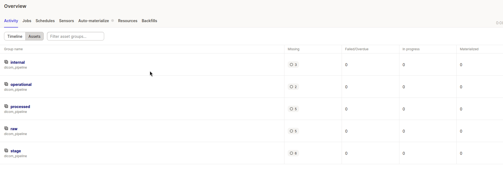
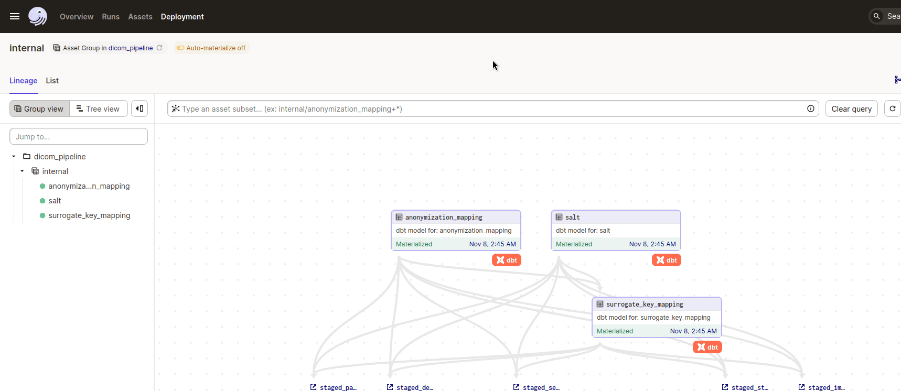
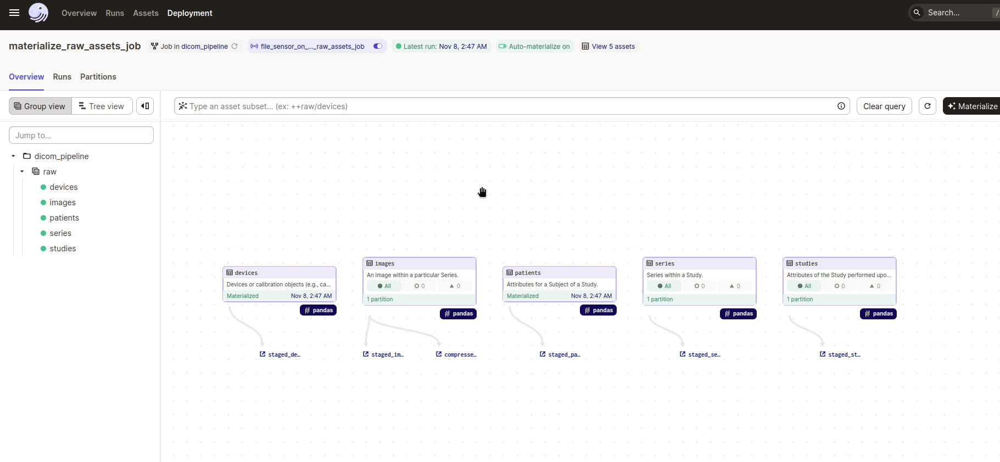
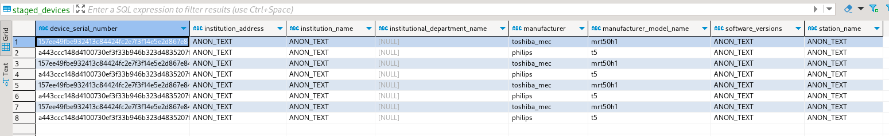

# Description

This crate works with the main pipeline and offers interaction with the database `dbt_snowflake` as well as core python modules `dicom_pipeline` to execute different tasks and jobs of interest. The project uses environment variables to facilitate running the setup in the cloud and will be updated in the future to update code after testing the utilities in production.

# Project Structure

```
└── dicom-pipeline
    ├── dbt_snowflake
    └── dicom_pipeline
```

`dbt_snowflake` represents [**dbt**](https://docs.getdbt.com/docs/introduction) crate to work with the database, seed models, and load sources from Python code. It is useful for this project to "translate" computed parquet files into actual tables with some additional transformations in between. I have decided to focus on using **dbt** macros to perform type casting, anonymization mapping, and joins wherever possible due to the reason that this tool provides many features to make your code uniform, configurable, and reliable across multiple [supported databases](https://docs.getdbt.com/docs/supported-data-platforms).

`dicom_pipeline` on the other hand represents [**Dagster**](https://docs.dagster.io/getting-started) related definitions to orchestrate the pipeline and transformations that are impossible inside the database. The goal was to build an initial version of a data processing system that could be used later on to organize data and provide an example project for somebody else who is going to be interested in working with a similar stack environment. Currently, I would consider this project a work in progress as it needs testing for cloud-based services such as **AWS Lambda, S3** and **Snowflake**. However, there is potential benefit from contemplating taking an approach to your own pipeline design or orchestration setup. It also provides a separate [readme](./dicom_pipeline/README.md) with more info about the project.

# Getting Started

```
git clone https://github.com/lithiferous/dicom-scans-etl
make dagster_deps
make dbt_deps
export DBT_DATABASE_NAME=dicom.duckdb
dagster dev
```

# Usage

The first step after launching the webserver would be to materialize support tables that will be used for every table to do PII cleanse and data-type casting. I have already addressed some use cases [here](../dicom-pipeline/README.md#L49-L76). Basically, those declarations help **dbt** standardize type conversions and define a proper anonymization approach for each entity to preserve the privacy of the medical data at hand. Prefix `internal` indicates that those tables ideally should be isolated from the rest of the pipeline to reduce chances of corrupting the data processing.



After support tables have been prepared it is possible to launch `raw` asset processing with the job: `materialize_raw_assets_job`, however, we have to provide details for the run and configure level of partitioning in code. Before the launch we have to toggle a sensor to run which will look into the [directory](../../data/dicom-files/) and if there are files kick off all tables from the `raw` group (`devices`, `images`, `patients`, `series`, `studies`). Finally, touch is to enable `AutoMaterialization`, which would materialize dependencies once both parents are ready and updated. This allows us to build only initial jobs for sensors, while the rest of the pipeline is automatically executed, once we launch initial jobs. The order of actions is displayed below:



Assets will materialize in the following pane:



# Explore Results



To explore files produced by the database I highly recommend [DBeaver](https://dbeaver.io/) for observing, and working with data and [Harlequin](https://duckdb.org/docs/archive/0.8.1/guides/sql_editors/harlequin.html) for quick tests, querying from command line. Currently data processing for this specific project is limited as I focused mainly on pipeline development to produce a reliable POC structure to work with, however, during the engagement with an actual project there would be many more milestones to cover to set up an effective platform using both domain knowledge and engineering to support the product.
